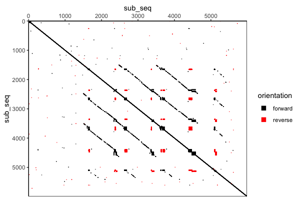

# seqdotplot

<!-- badges: start -->
<!-- badges: end -->

An R package for producing sequence similarity
[dotplots](https://en.wikipedia.org/wiki/Dot_plot_\(bioinformatics\)). Uses a
sparse matrix representation and parallelism to reduce memory usage and speed
up computations. This package also handles reverse complement matches and
outputs a customisable ggplot object. This has been tested with sequences
up to 150kb long.

## Installation

You can install the development version of seqdotplot from [GitHub](https://github.com/) with:

``` r
if (!require("remotes", quietly = TRUE)) install.packages("remotes")
remotes::install_github("shians/seqdotplot")
```

## Example

``` r
library(seqdotplot)
seq <- readLines(system.file(package = "seqdotplot", "dxz4_cast_ref.fa"))[2]
sub_seq <- substr(seq, 68000, 74000)
seqdotplot(sub_seq, sub_seq, threads = 2)
```


